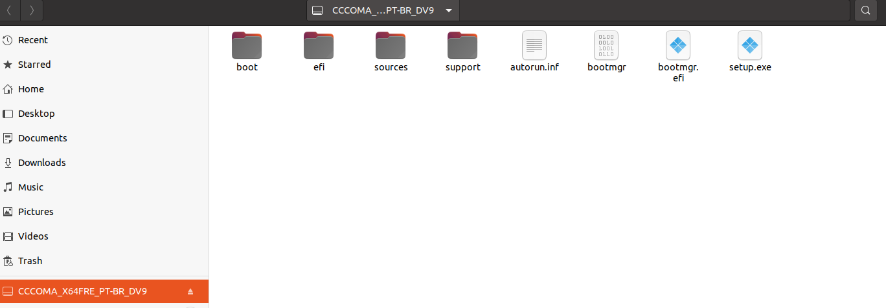

# Instalação do Windows em estação de trabalho (Single Boot)

### Testado com:
- Ubuntu 20.04.4 LTS (Focal Fossa)

1 - Faça o download da imagem do windows (ISO)

```bash
wget 'https://software.download.prss.microsoft.com/dbazure/Win10_21H2_BrazilianPortuguese_x64.iso?t=e3b74e3e-b5c9-46a0-9e07-ccfe1c6468d7&e=1658507156&h=62ee6cfa22d176b2bb6d59d22855d2051c68bacab6fc46afda575c86d4315fdc' -o Windows10.iso
```

2 - Faça o download da ferramenta para criar pendrive bootável

```bash
wget 'https://github.com/ventoy/Ventoy/releases/download/v1.0.78/ventoy-1.0.78-linux.tar.gz'
tar -xf ventoy-1.0.78-linux.tar.gz
```

3 - Execute a ferramenta

```bash
cd ventoy-1.0.78
./VentoyGUI.x86_64
```

3.1 - Selecione o dispositivo e clique em install


3.2 - Monte o arquivo ISO

Para fazer isso, basta dar um clique duplo no arquivo de imagem .ISO. Observe que logo em seguida, ele será montado:


3.3 - Copie todos os arquivos do volume montado após abrir a imagem .ISO para dentro do volume chamado "Ventoy".



3.4 - Aguarde a cópia finalizar

3.5 - Faça a ejeção do dispositivo USB

4 - Configure a BIOS para dar boot no dispositivo USB e prossiga com a instalação do Windows normalmente


